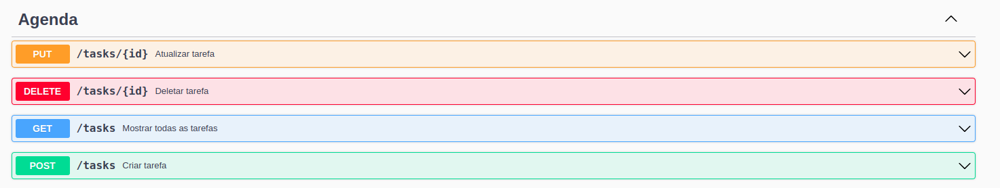

<h1 align="center">
  AgendaToDo
</h1>
<h2 align="center">
  Sistema de Gerenciamento de tarefas
</h2>

<p align="center">
 
 
</p>

 API para gerenciar tarefas que faz parte do [desafio](https://github.com/simplify-liferay/desafio-junior-backend-simplify) da Simplify, para desenvolvedores backend júnior.
Ela te permite gerenciar tarefas de forma prática e eficiente. 

## Funcionalidades da API
Com esta API, você pode:
- Criar novas tarefas.
- Visualizar todas as tarefas presentes na lista.
- Marcar tarefas como concluídas.
- Remover tarefas da lista conforme necessário.


## API Endpoints
caso deseje compilar e navegar por si só no sistema siga para [como executar](#como-executar)
### [swagger do projeto](http://localhost:8080/swagger-ui.html)



Com esta API, você pode:

1. **Criar Tarefa**
    - **Método:** `POST`
    - **Endereço:** `/tasks`
    - **Request Body:**
   ```json
   {
       "name": "Criar tarefa",
       "description": "Requisição web",
       "done": false,
       "priority": 3
   }


#### 2. **Listar Tarefas**
- **Método:** `GET`
- **Endereço:** `/tasks`
- **Descrição:** Retorna uma lista de todas as tarefas cadastradas.
- **Exemplo de Resposta:**
```json
[
  {
    "id": 18,
    "name": "Agenda-Desafio",
    "description": "Construir a API do zero",
    "done": true,
    "priority": 10
  },
  {
    "id": 4,
    "name": "Estudar",
    "description": "Implementação do swagger para documentar os end-points",
    "done": true,
    "priority": 6
  },
  {
    "id": 19,
    "name": "Treinar",
    "description": "Academia",
    "done": true,
    "priority": 4
  }
]
```


#### 3. **Atualizar Tarefa**
- **Método:** `PUT`
- **Endereço:** `/tasks/{id}`
- **Descrição:** Atualiza as informações de uma tarefa existente, utilizando o ID como parâmetro.
- **Request Body:**
```json
{
    "name": "Nova tarefa",
    "description": "Requisição web",
    "done": false,
    "priority": 3
}
```

#### 4. **Remover Tarefa**
- **Método:** `DELETE`
- **Endereço:** `/tasks/{id}`
- **Descrição:** Remove uma tarefa da lista, utilizando o ID como parâmetro. Retorna a lista atualizada de tarefas após a exclusão.

## Tecnologias

- [Spring Boot](https://spring.io/projects/spring-boot)
- [Spring MVC](https://docs.spring.io/spring-framework/reference/web/webmvc.html)
- [Spring Data JPA](https://spring.io/projects/spring-data-jpa)
- [SpringDoc OpenAPI 3](https://springdoc.org/v2/#spring-webflux-support)
- [Mysql](https://dev.mysql.com/downloads/)
- [Workbench](https://www.mysql.com/products/workbench/)
- [Postman](https://postman.com/)
- [Git](https://git-scm.com/)
- [H2 DataBase](https://www.h2database.com/html/main.html)
- [Bean Validation](https://beanvalidation.org/)


## Práticas adotadas

- SOLID
- API REST
- Consultas com Spring Data JPA
- Injeção de Dependências
- Tratamento de respostas de erro
- Geração automática do Swagger com a OpenAPI 3
- Testes automatizados
- Banco de dados relacional

## Como executar

- Clonar repositório git

```
git clone https://github.com/GustavoDaMassa/AgendaToDo.git
```

- Construir o projeto:
```
$ ./mvnw clean package
```
- Executar a aplicação:
```
$ java -jar target/Agenda-0.0.1-SNAPSHOT.jar
```

A API poderá ser acessada em http://localhost:8080/tasks.
